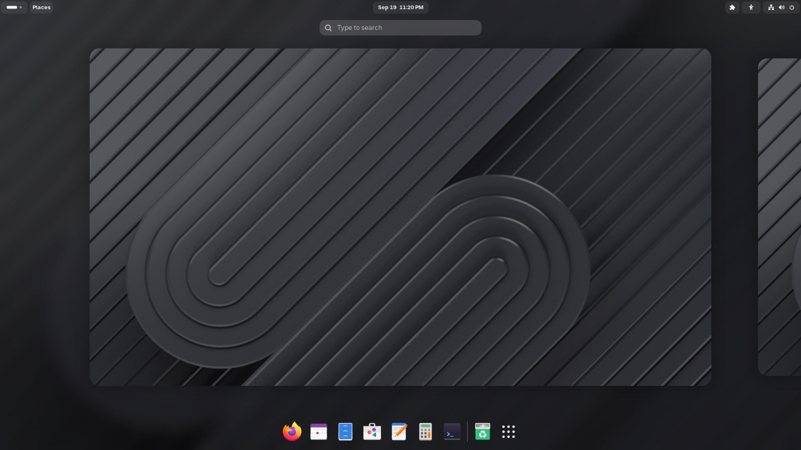
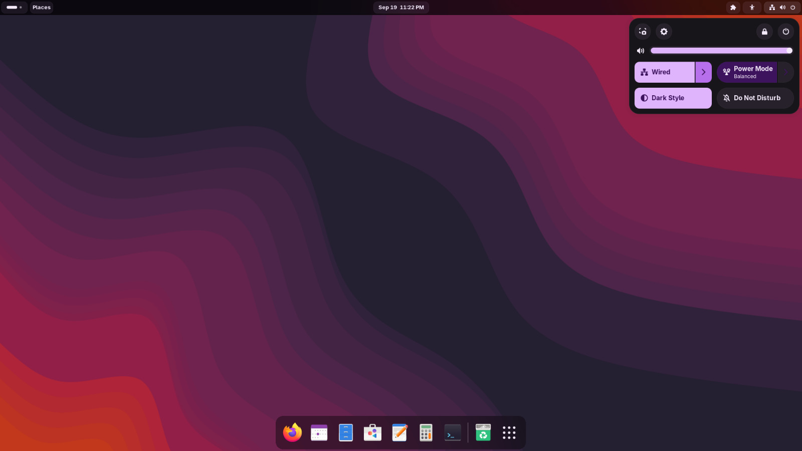
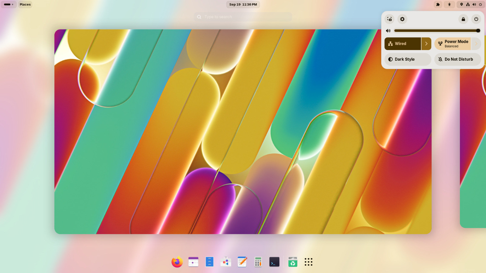
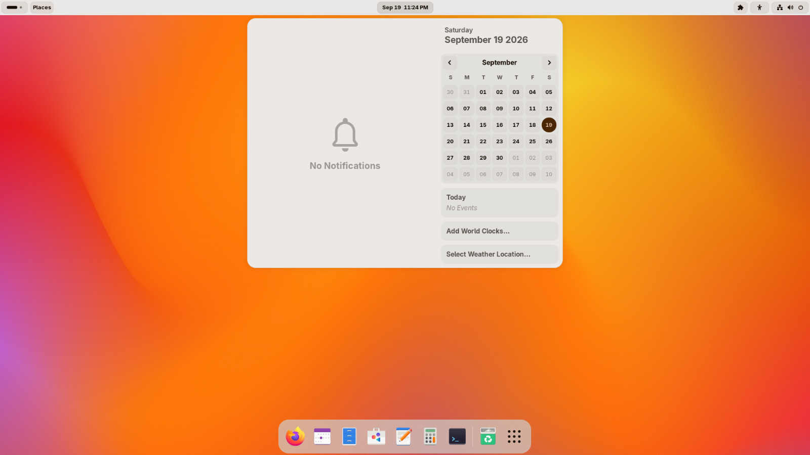
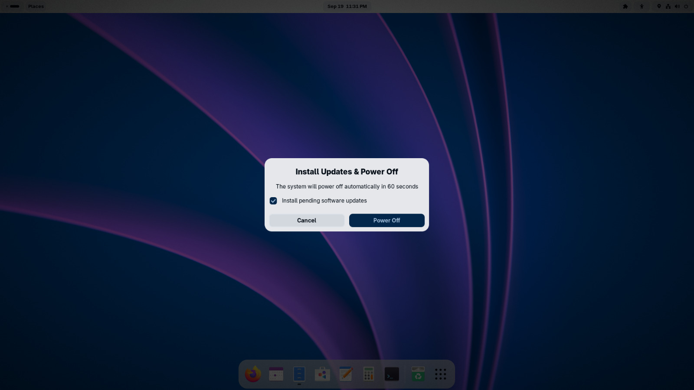
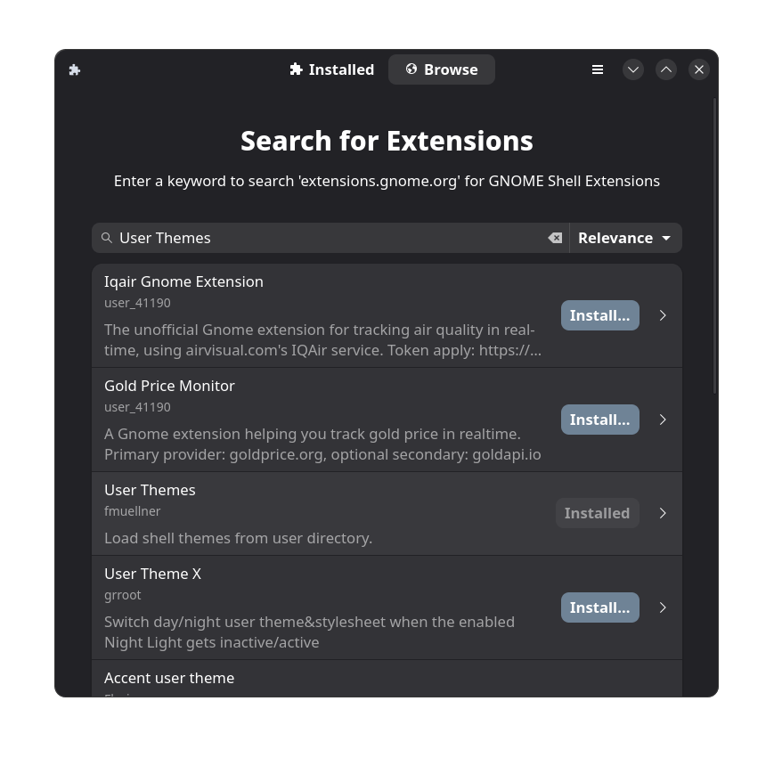
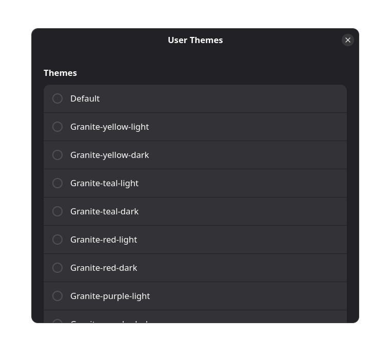

# Granite-GTK-Theme
A visually pleasant and versatile GTK theme based on [Marble Shell](https://www.gnome-look.org/p/1977647).
This is a personal project and is not intended to copy the Marble theme.

## Extensions needed
- User themes (required)
- Blur my shell (optional but highly recommended)

# Screenshots

---

# Installation guide

1. **Install GNOME Extensions** 

    **Debian**  
    `sudo apt install gnome-extensions`

    **Fedora**  
    `sudo dnf install gnome-extensions`

    **Arch**  
    `yay -S extension-manager`

2. **Install User Themes extension**

    

3. **Copy theme folders to ~/.local/share/themes**

    `cp -r ~/Downloads/Granite-GTK-Theme/Granite/. ~/.local/share/themes`

4. **Open User Themes extension's settings and select your theme**

    

